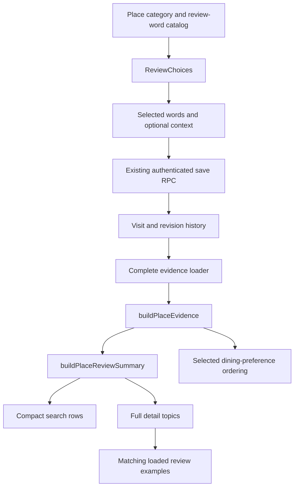

# Tavvy review experience — implementation guide

**Updated:** September 22, 2026. The original redesign was released September 21; this guide also describes the deployed review-entry and image corrections made after user feedback. See the latest status entry for deployment confirmation.

**Scope:** the implemented review and search-card redesign across Tavvy web and mobile, including the existing data services it uses. This is not a completion report for every historical Tavvy task. See [PROJECT_STATUS.md](PROJECT_STATUS.md) for the wider project.

## 1. What this implementation does

Tavvy helps someone understand **what people experienced** and decide whether a place suits them. Food, sleep, atmosphere, service and practical concerns remain distinguishable instead of being reduced to one overall score.

The implementation has three parts:

1. **Compare places:** compact search cards with a photo, useful place information and up to two evidence rows.
2. **Understand a place:** a fuller summary on its detail page, with topics that open matching review examples.
3. **Share an experience:** a short form where customers select words, optionally add context, and post.

The same evidence and choice logic is used on web and mobile. Platform-specific components handle browser and native interactions.

### September 22 corrections

Web commit `3127da8` is deployed to Tavvy.com with a successful health gate and live browser checks. It fixes the off-screen review sheet, combines duplicate choices, simplifies section navigation, enlarges search photos and adds the detail-page image fallback. Matching mobile source `55a686b` is published and checked in the existing iPhone development app; it has not been distributed as a new binary.

### Original redesign release status

| Area | Confirmed status for this release |
| --- | --- |
| Web implementation | Published in commit `1c5e8e4` on `release/verified-web-20260921`; successfully deployed to Tavvy.com. |
| Web handoff | Commit `e401591` adds the release record. Its documentation-only deployment also succeeded. |
| Mobile implementation | Published in commit `5da4f2e` on `release/native-preview-20260921`. |
| Mobile handoff | Commit `7312b4a` records verification and release limits. |
| Native verification | Existing iPhone 17 Simulator development app loaded the updated JavaScript; additional component checks used isolated in-memory fixtures. |
| Distributed mobile app | A new binary containing these changes was **not** built or distributed in this batch, honoring the user's build hold. |
| Database | This redesign added no production schema migration. It uses existing review, history and moderation services. |

This guide supersedes earlier descriptions of an equal 2×2 grid on search cards.

## 2. Search results: compact enough to compare

### Card structure

Each redesigned place card contains:

- Place name and category/subcategory.
- Distance when usable distance data is available.
- Address information when supplied by the place record.
- A 172 px photo header (September 22 update) with the name, category, distance and address set on a dark shade; up to five real photos swipe with a `1 / N` counter and step buttons, and a category illustration is a single labeled image. The name opens the place.
- One expandable review row per section (September 22 presentation update): the row's
  background is the frequency bar, with the section label, the word and the people count on it.
- One `Reviews · people · period` line above the rows.
- Available actions, such as Directions, Call, Website and opening the full place.

Web uses `components/SignalCard.tsx`. Native search results use the card renderer in `screens/HomeScreen.tsx`. Both use `components/PlaceReviewGrid.tsx` in its default compact mode.

The card grows when text needs to wrap; its height is not fixed. The phone-width browser fixture stayed below 290 pixels per card. That is a checked example, not a guarantee for every translated label or accessibility text size.

### How the card rows are selected

`cardReviewRows()` in `lib/placeReviewSummary.ts` builds one row per section:

1. **The core experience:** its positive topics, most-mentioned first.
2. **The Good** and **The Vibe:** their topics as supplied.
3. **Heads Up:** every current concern, with core concerns (serious ones first) ahead of the others, so the most relevant concern is the one visible while the row is collapsed.

Each row shows its first topic; a chevron expands the row to the section's other words without leaving the results. When a section has no evidence, its row says so (more recent reviews needed, or no recent concerns reported). `searchReviewSections()` (three highlight lines) and the earlier two-row `compactReviewSections()` remain exported for compatibility and tests.

Every row uses the same treatment as the place page: the row background is a frequency bar whose length is the people count out of the recent reviewers — teal for positive topics, purple for atmosphere, amber for concerns — with the section label, the word and the count on top. Concerns keep their `!` marker. Bars are hidden when fewer than five people reviewed recently, because a tiny sample would otherwise look like a full bar.

The card's review block opens with a `Reviews · {{count}} people · Last 6 months` line so the rows read as reviews at a glance. Dated older concerns show a short `· Older` suffix on cards; the full `Older report · date` stays on the place page. Below the rows, an icon row offers the same shortcuts as the place page action row (Call, Directions, Website, Details), each present only when its link exists.

Illustrative layout only; these are not published reviews or a real business:

```text
[photo header: Example Bistro · Italian restaurant · 0.4 mi · Example Street, Boston   1 / 3]

Reviews · 12 people · Last 6 months
[The food   Delicious food ██████████░░░░░░░░░░  12  ⌄]
[The Good   Friendly staff █████░░░░░░░░░░░░░░░   6  ⌄]
[The Vibe   Relaxed ████░░░░░░░░░░░░░░░░░░░░░░   5  ⌄]
[Heads Up   ! Food arrived cold ██░░░░░░░░░░░░░   3  ⌄]

(Call)   (Directions)   (Website)   (Details)
```

The numbers can overlap: the same reviewer may mention food quality and slow service.

### Photos and distance

- Existing real-photo selection takes precedence over category illustrations.
- An illustration is labeled **Illustration**; it does not claim to depict the business.
- Category images are display fallbacks, not uploaded business photos.
- The web card tries remaining real images when an image fails, then falls back to the category illustration.
- More than one real photo produces a `+N` badge. Full place media remains available on the detail page.
- Distance stays in meters until `lib/placeDistance.ts` formats it. Zero and invalid coordinates have explicit handling.
- Native can calculate distance from available device coordinates; web displays the distance supplied for its search context. These are not driving distances.

The photo library and distance helpers predate this batch. The redesign preserves and tests their behavior; it does not introduce a new image library or geocoder.


### Detail-page image continuity

The standard place detail hero now uses the same deterministic category-image library and place ID as search. It prefers real approved cover/gallery photos, tries another real photo if loading fails, and then uses a clearly labeled **Category illustration**. An illustration is never inserted into the business record or its photo gallery. Real uploaded photos replace it automatically when present in the viewer-approved response. The native place hero follows the same rule. This does not bypass photo moderation or visibility checks.


## 3. Place details: a fuller explanation of the evidence

### Page structure (September 22 update)

Every place on Tavvy uses the same screen; only category-driven content changes. The photo
header swipes through the place's real photos (`1 / N` counter, step buttons, a **View all
photos** chip that opens the Photos & Stories tab) and shows the category pill as
`CATEGORY · SUBCATEGORY` when a subcategory exists. Under the action icons sit sticky tabs:
**Overview** (Tavvy Places description and tags, the compact four-row review teaser — tapping a
row opens the Reviews tab on that word — an **Order & pay** block when delivery links or
reported payment details exist, Visit & contact, Location & hours), **Reviews** (the full
summary below, matching experiences for a selected word, and the recent reviews list),
**Photos & Stories**, and **Tavvy Menu** only when the place has a menu ("Rooms" for hotels;
it opens the full menu page as before). The old Details tab folded into Overview; `?tab=details`
links still open Overview.

The full summary displays four conceptual sections:

| Section | Purpose |
| --- | --- |
| Main experience | What the business primarily provides, including relevant praise and concerns. |
| The Good | Other benefits, without repeating the core topics. |
| The Vibe / Their Style | Atmosphere or the appropriate interpersonal style for that domain. |
| Heads Up | Other current or unresolved concerns, without repeating concerns already in the main section. |

The core heading is more prominent. Concern topics have an explicit `!` marker and distinct text treatment; color is not the only distinction.

### Presentation (September 22 update)

The Reviews tab is titled **Reviews** and opens with one quiet line, `{{count}} people · Last 6 months` (or `Early impressions · 1 reviewer`), followed by an **About these numbers** control that reveals the counting explanation on demand. It then shows exactly the rows a search card shows — one per section from `cardReviewRows()` — with the row background as a frequency bar on one scale per place (people who mentioned it out of recent reviewers), the section label, the word and the count on top. Tapping a row selects that word and shows matching experiences; the chevron at the row's end opens the section's other words, each of which can be selected too. Bar length is frequency only — never quality or severity — so a rarely mentioned serious concern keeps its `!` marker and its priority position instead of relying on bar length. Bars are hidden below five recent reviewers. The accent for section headings and controls is the logo teal.

Practical details from `evidence.practical` (for example cash only or reservation policy) appear in a neutral **Good to know** row, separate from Heads Up. Individual reviews show the reviewer, the date, the words they chose as tone-colored chips (concerns marked `!`), and the optional note; they never show frequency bars. The report/block control stays available but is visually secondary.

Expanding a row reveals the topics in the summary payload, not every historical review. The evidence builder currently retains the top four positive core topics and up to twenty positive/supporting atmosphere topics.

### Opening supporting reviews

- Topic buttons include the word, reviewer count and an accessible explanation.
- Web place details and native place details filter their loaded review preview to matching topic labels, showing up to two matching examples.
- **All experiences** clears the topic selection.
- Where available, **See all reviews** opens the broader review history.
- A missing match in the loaded preview is explained; it is not treated as proof that the aggregate count is false or that no historical review exists.
- Changing the place resets the selected topic.

Cruise detail pages use the same summary component, but filter their own paginated guest-report feed.

The component is still named `PlaceReviewGrid` for compatibility with callers. It now renders compact rows or full sections, not the old four equal tiles.

## 4. How “The Main Thing” is populated

The main experience is a **derived presentation group**. It is not a new review table or a fourth `review_items.signal_type` value.

The existing catalog has these types:

| Catalog type | Evidence category |
| --- | --- |
| `best_for` | `good` |
| `vibe` | `vibe` |
| `heads_up` | `headsup` |

`coreForCategory()` selects a domain definition from the place category and subcategory. `isCoreSignal()` applies that definition to the normalized signal slug and label.

- Matching positive and atmosphere signals can support the main experience. For example, a hotel’s quiet-room signal can support sleep.
- Matching concern signals can appear beside those positives.
- Main choices are removed from the other choice groups in the form.
- Displayed main topics are removed from the supporting summary sections.
- RV and ride classifications use curated stable tap slugs to avoid accidental interpretations such as a camp store defining campsite quality.
- Unknown categories fall back to **The main experience**.

There is **no implemented AI pipeline in this release that reads free-text notes and automatically turns them into core review counts**. Counts come from structured selected signals.

### Domain examples supported by the mapping

| Place/domain | Main heading or treatment |
| --- | --- |
| Restaurants, food trucks, catering, ice cream | The food |
| Cafés, mobile coffee | The coffee & food |
| Bars | The drinks |
| Nightlife | The night out |
| Hotels and lodging | The sleep |
| Overnight cruise ships | The onboard experience |
| Campgrounds and RV sites | The campsite |
| Boondocking and overnight parking | The overnight stay |
| Dump stations | The dump stop |
| National parks and outdoor destinations | The outdoor experience |
| Beaches | The beach experience |
| Theme-park rides | The ride experience |
| Theme parks | The attractions |
| Restrooms and public showers | The facilities |
| Laundry | The laundry |
| Wi-Fi hotspots | The connection |
| Water fill stations | The water stop |
| Propane stations | The refill |
| Airports | The travel experience |
| Shopping | The shopping experience |
| Beauty, barbers and similar services | The result |
| Health services | The care |
| Fitness | The workout |
| Automotive/mobile mechanics | The service |
| Home services / professional review form | The work |
| Pet services | The pet care |
| Education | The learning |
| Transportation | The journey |
| Religious places | The community |
| Events | The event experience |
| Cities | The place |
| Realtors | The real estate service; atmosphere becomes Their Style |
| Other/unrecognized categories | The main experience |

The mapping supplies the correct grouping and heading. Actual available words still depend on the domain catalog. A category heading alone does not establish that its catalog, records or every tool screen is complete.

## 5. What the review numbers mean

`buildPlaceEvidence()` in `lib/placeEvidence.ts` constructs the evidence.

### Recent evidence

1. Discard visits with invalid dates or dates in the future.
2. Use the last **180 days** for recent positive/atmosphere counts and recent-reviewer totals.
3. Group each topic by its normalized slug, falling back to its label.
4. Count distinct reviewer identities within each topic.
5. Sort positive topic counts descending, with a label tie-breaker.

The UI calls this window **Last 6 months**; the calculation is 180 days, not six calendar months.

### People, visits and emphasis are different

- Three visits by the same account mentioning the same word count as one reviewer for that word within the window.
- Emphasis `3` still counts as one reviewer.
- One account can count toward several different words.
- `recentReviewers` is the distinct identity count across recent visits, not a sum of topic counts.
- Legacy records without a reviewer identity use a review-ID fallback. This is not proof of independently verified human identity.

The user-facing word “people” refers to this reviewer-identity counting rule. The redesign does not add identity verification or a new anti-fraud system.

For a single recent reviewer, the summary says **Early impressions · 1 reviewer**. Empty, unavailable and loading results remain separate states.

### Older concerns

Concern history uses all valid loaded visits. A concern with no recent occurrences can still be shown when unresolved. Its count is the all-history distinct reporter count and it receives **Older report** plus its latest report date. That historical count must not be presented as a recent count.

## 6. How concerns age without deleting history

These are existing evidence rules retained by the redesign. They change prominence; they do **not** delete the original review.

A later report qualifies toward ordinary fading only when it:

- Occurs after the latest occurrence of that particular concern.
- Falls within the current 180-day window.
- Comes from a different account from the accounts that reported that concern.
- Contains at least one `good` signal.
- Does not repeat the same concern.

Only the latest qualifying visit per account counts toward the later-report total.

| Internal state | Current rule |
| --- | --- |
| `improved` | Non-serious concern; latest occurrence is older than 180 days; at least five qualifying later accounts; at least three of those accounts also report a mapped opposing positive signal. |
| `faded` | Non-serious concern; latest occurrence is older than 180 days; at least five qualifying later accounts, but the stronger improvement condition is not met. |
| `current` | Neither fading condition applies and at least two distinct accounts report the concern in the recent window. |
| `unconfirmed` | Neither fading condition applies and fewer than two recent accounts report it. This can include a dated unresolved older report. |

`current` and `unconfirmed` concerns remain eligible for the summary. `faded` and `improved` concerns remain in the evidence/history but are excluded from its current concern highlights.

Direct improvement mappings currently cover speed, quiet and cleanliness. A cruise-specific rule requires **restful cabins** to counter **noisy cabins**; quiet public lounges do not establish that cabin noise improved.

Serious food-safety/allergen, unsafe-access, accessibility, discrimination and harassment patterns are excluded from automatic fading/improvement. Serious concerns are prioritized when summary concerns are ordered.

Practical information such as cash-only or reservation requirements is separated into `practical`; it is not treated as a quality complaint. The new review summary does not automatically turn that array into verified business facts.

**Interpretation:** `faded` and `improved` are rule-based evidence states. They are not an owner-verification badge, a guarantee of a fix, or a claim that five unrelated positive reports disprove a complaint. Silence alone never triggers either state.

## 7. Leaving a place review

### Customer flow

1. Open the place’s review action and sign in when required.
2. See **What stood out?** and the domain’s main experience first.
3. Tap a word once to select it; tap again to remove it.
4. Optionally select words from other sections.
5. Optionally add a public note, change the visit date, or edit the previous review.
6. Post and wait for server confirmation.

At least one word is required, but no particular section or positive word is required. A review can consist entirely of a concern. Written context is optional for ordinary place reviews.

### Keeping the form short

- Main choices alternate praise and concerns when both exist.
- Open the main section first. The other sections are compact expandable headings, with a count of selected words. Only one section is expanded at a time outside search.
- Initially show up to eight choices in an open section. **More words** exposes the rest; reducing the list keeps selected choices visible. Collapsing a whole section keeps its selections and shows their count in the heading.
- **Find a word** searches every section and every source label/slug, opens matching sections, and never clears selections.
- Empty sections are not rendered in the choice form.
- Optional **Add emphasis** exposes levels 1–3 after a choice is selected.
- Selection limits follow the persistence contract: at most 100 words for ordinary place reviews and 30 for cruise reports.
- At the limit, additional choices are disabled while selected choices can still be removed.
- Public notes are limited to 4,000 characters.

### Duplicate words and existing reviews

`reviewComposerChoices()` groups repeated labels and a small explicit set of synonyms (for example, Amazing Food / Great Food). It does not use fuzzy matching or merge different issues such as slow service and a slow kitchen. Opposite sentiments remain separate.

Each displayed choice retains all source catalog records in `sources`. A new selection uses one stable existing ID. An edit recognizes whichever original IDs were selected, preserves them and their emphasis until changed, removes every alias when the choice is deselected, and changes emphasis only on IDs already selected. No catalog records or review history are deleted. Search recognizes the original labels as well as the displayed label.

The ordinary review footer counts unique displayed choices, while persistence limits still apply to actual submitted IDs. Historical summary labels and counts are not rewritten by this composer cleanup; a future summary-vocabulary migration needs its own evidence and topic-link checks.

### Web and native behavior

Web place pages and `/app/add-review` share `components/AddReviewSheet.tsx`. A signed-out visitor is sent to sign in with a return URL for the review form, so signing in does not require finding the review action again. The dedicated form hides bottom navigation.

The review overlay must remain fixed to the viewport. The earlier stylesheet was nested inside the sheet, leaving its outer overlay outside the styled-jsx scope. On a real detail page this rendered the form below the content, which looked like an unresponsive button. The stylesheet now scopes from the overlay root; its stacking level clears page navigation. The browser regression opens the actual detail-page action after scrolling and asserts dialog/footer viewport bounds.

The sheet locks background scrolling, supports Escape, traps keyboard focus, restores focus when closed, and keeps its Post action outside the scrolling content.

Native uses `screens/AddReviewScreen.tsx` with the same choice logic, app theme, safe-area handling, keyboard accommodation and a persistent Post area. Unsaved navigation presents Keep editing/Discard; navigation is blocked while a save is in progress. Native selection provides optional haptic feedback.

In-memory selections and notes survive a failed save. A mounted web sheet can retain its draft when closed/reopened for the same identity. This is **not** a general offline-draft, cross-device draft or reload-recovery feature.

### New visits versus edits

- A new visit adds an experience with a valid visit date.
- Editing restores the previous signals and their emphasis.
- The existing private owner note is preserved when editing; it is not displayed as public content.
- The edit path keeps the original visit date/history instead of making an old experience look newly reported.
- Repeated visits remain distinct historical experiences, while aggregate topic counts deduplicate reviewers.

## 8. Saving, retries and data loading

### Existing persistence contract

Ordinary place reviews use `lib/reviewPersistence.ts` and the existing `save_place_review_v2` RPC.

The client validates signal UUIDs, duplicates, emphasis, note length, identity and date. It authenticates the author, sorts signal IDs for a stable request identity, and sends `new_visit` or `edit` with a request key.

The existing server transaction owns canonical-place resolution, review persistence and tap replacement. Opening the form uses read-only resolution and does not create a place merely by viewing it. Missing RPC support produces an unavailable error, not a fallback to destructive legacy writes.

### Duplicate protection

`lib/reviewRequestStore.ts` retains the request key for the same pending payload:

- Web uses in-memory storage plus `sessionStorage` when available.
- Mobile uses in-memory storage plus `AsyncStorage` when available.
- Storage keys hash the payload identity rather than containing the note text.
- The key is retained after an uncertain or failed save and cleared only after confirmation.
- A changed payload gets its own identity.

Form-level ref locks also prevent repeated immediate submissions. A returned error or unconfirmed result does not produce the success screen. The browser regression test confirms that a retry after failure reuses the same request key.

### Loading complete evidence

`lib/placeEvidenceService.ts` prefers the existing snapshot/cursor-based `get_place_review_evidence` RPC. It reads all pages needed for the batch, validates response shape and retries a changed snapshot once.

If the RPC is absent on an older installation, a bounded read-only legacy path reads live reviews, taps and catalog definitions. Failed, inconsistent or incomplete reads produce `unavailable`, not an apparently empty or partially calculated success.

Place batches contain five records with at most four batches in flight per group. The summary-loading wrapper also has a timeout. These bounds support responsiveness; very large or incomplete histories may deliberately remain unavailable.

Noncanonical/external identities are not automatically treated as canonical UUID evidence subjects. An indexed listing can legitimately show unavailable review evidence until its canonical review identity is available. This release does not manufacture zero-review results for such listings.

## 9. Different review domains retain their own contracts

### Cruises

`components/cruises/CruiseReviewPanel.tsx` on both platforms now uses the shared full summary and shared review choices.

Cruise-specific behavior remains:

- Reports belong to a ship’s Universe identity and a guest’s sailing date.
- Cabin category and public note are optional; cabin number/current whereabouts are discouraged.
- The sailing date must be valid and not in the future.
- An update for the same sailing follows the existing history-preserving save contract.
- A successful save refreshes evidence and the guest feed.
- Switching ships or accounts clears the composer context and invalidates stale responses.
- The native modal keeps Save/Cancel outside the scrolling choices.
- Topic filtering applies to the loaded guest reports; more reports can be loaded.
- Report/block controls and late-pagination protections remain in place.
- Blocking changes the personal feed; the shared summary still reflects eligible public evidence.

The existing RPCs are `get_cruise_universe_evidence_v1`, `get_cruise_universe_reviews_v1` and `save_cruise_universe_visit_v1`. Individual onboard venues use their canonical place review flow rather than mixing their reviews with the entire ship.

### Pros and Realtors

Provider reviews remain a separate typed system using `lib/providerReviewTaps.ts` and `submit_pro_provider_review_v1`.

This batch improves terminology, selection/removal, theme treatment and submission locking. It does not move provider reviews into ordinary place-review tables.

| Requirement | Provider behavior |
| --- | --- |
| Main topic | Required; The work or The real estate service. |
| Other topics | The Good, style and Heads Up are optional. |
| Choices | One choice per dimension, with tap-again removal. |
| Realtor style examples | Hands-on, Calm, Direct, Friendly, Proactive. |
| Overall assessment | Existing 1–5 storage contract remains; the form presents Very poor, Poor, Mixed, Good, Excellent. |
| Written experience | Still required, at least 20 characters and no more than 4,000. |
| Short title | Optional. |

Provider profile review labels match the domain. This is not a claim that every legacy provider score or every provider discovery card has been replaced by the ordinary place summary.

### Events and other place tools

Native `AddReviewScreen` preserves its event branch and delegates to `lib/eventReviews.ts`. Existing event reviews restore their selections and notes for editing. The event persistence model was not rewritten in this batch.

RV, On The Go and other callers of the shared place-summary components inherit the summary presentation and category behavior. Their location/session, catalog, permissions and business-specific features remain separate systems.

### Overview without repeats, Reviews tab filters, and the photo menu (September 22 follow-up)

- Overview order: review rows first (the grid's `Reviews · N people · Last 6 months` line is the heading; `action` prop carries See experiences), Tavvy Places, Location & hours, Order & pay (delivery links + reported payment facts), place-specific content, then Follow (social links) and Manage or claim. Anything in the icon row (Call, Website, Directions, Reserve, Order, eCard, Share) is never repeated below it. Same on mobile.
- Reviews tab: summary rows, then Recent reviews filtered by the selected word, period (Last 6 months / All time, 180-day cutoff on `createdAt`), With comments, and order, ten at a time with Show more.
- Photo menu (`/place/[id]/menu-gallery`, mobile `MenuGalleryScreen` photo mode): full-screen photo pages, floating bar and filters, no place header or bottom arrows. `menuAppearance().entryView` decides what `/menu` opens (text designs → list; Visual/default → photos; `?view=list` stays on the list); one icon switches views. QR codes encode `/menu`.

## 10. Preference-based search ordering

Dining preference options remain **Great food**, **Quiet conversation**, **Quick visit** and **Good value**.

`aspectSupport` now records distinct positive reviewers, concerned reviewers and their union for each supported aspect. Several matching words from the same account no longer multiply its influence on that aspect.

The internal preference score is:

```text
(positive reviewers − concerned reviewers) / (distinct respondents + 5)
```

The denominator adjustment tempers small samples. It adds no records or displayed reviewer counts. A person who reports both praise and a concern is included in both sets, but only once in the respondent union.

Unavailable evidence, no recent reviewers or no respondents for the preference receives the existing insufficient-information treatment. Older payloads without `aspectSupport` use maximum available topic counts as a compatibility fallback rather than summing overlapping tags.

This is an internal ordering heuristic for a selected dining preference, not a displayed rating, confidence interval, calibrated probability or “percentage match.” It is not yet a universal personalization/ranking system for every tool. The verbose per-card match explanation was removed to keep comparison cards short.

## 11. Data flow and code map



### Shared logic changed in both repositories

| File | Responsibility |
| --- | --- |
| `lib/placeEvidence.ts` | Core-domain classification, distinct-account aspect support, existing evidence and concern-aging rules. |
| `lib/placeReviewSummary.ts` | Topic/section projection, compact row selection, older-report metadata, legacy tile compatibility. |
| `lib/reviewComposer.ts` | Main/supporting choice groups, interleaved praise/concerns, toggle behavior and collapsed visibility. |
| `lib/discoveryEvidence.ts` | Dining preference matching using distinct-account aspect support. |
| `lib/releaseCopy.ts` | Explicit mapping of application-owned copy to translation keys. |

The first four files were checked for identical contents across web and mobile at publication. They are mirrored source files, not an automatically synchronized shared package.

### UI files changed

| Web | Mobile | Responsibility |
| --- | --- | --- |
| `components/PlaceReviewGrid.tsx` | Same relative path | Compact/full summary rendering. |
| `components/ReviewChoices.tsx` | Same relative path | Shared choice interaction on each platform. |
| `components/SignalCard.tsx` | `screens/HomeScreen.tsx` | Compact search-result card. |
| `components/PreviewPlace.tsx` | `screens/PlaceDetailsScreen.tsx` | Full summary and topic-based review preview. |
| `components/AddReviewSheet.tsx` | `screens/AddReviewScreen.tsx` | Place review form, edit and save lifecycle. |
| `pages/app/add-review.tsx` | Native AddReview route | Web direct route now delegates to the common sheet. |
| `pages/app/search.tsx` | `screens/HomeScreen.tsx` | Less header/card repetition and compact comparison layout. |
| `components/cruises/CruiseReviewPanel.tsx` | Same relative path | Cruise summary, composer and feed behavior. |
| `components/providers/ProviderReviewForm.tsx` | Same relative path | Provider wording, toggle and save behavior. |
| `components/providers/ProviderProfile.tsx` | Same relative path | Domain-specific review labels. |

Supporting existing modules include `lib/signalCatalog.ts`, `lib/signalService.ts`, `lib/signalTapSelection.ts`, `lib/reviewPersistence.ts`, `lib/reviewRequestStore.ts`, `lib/placeEvidenceService.ts`, `lib/reviewSummaryLoader.ts`, `lib/placePreviewImage.ts`, `lib/placeDistance.ts`, `lib/cruises/reviews.ts` and `lib/providerReviewTaps.ts`.

### Summary contract and compatibility

```ts
type ReviewTopic = {
  label: string;
  count: number;
  tone: 'positive' | 'neutral' | 'concern';
  slug?: string;
  lastReportedAt?: string;
  older?: boolean;
};

type ReviewSection = {
  key: 'main' | 'good' | 'vibe' | 'headsup';
  title: string;
  topics: ReviewTopic[];
};
```

`PlaceReviewSummary` retains its existing `tiles` field and adds optional `coreLabel` and `sections`. `reviewSections()` can adapt an older tile payload so older APIs and clients can coexist during rollout. New consumers should prefer sections and must not reinterpret intensity as reviewer count.

The underlying evidence still contains a legacy `confidence` field. The redesigned summary does not present it as an overall place rating.

## 12. Appearance, accessibility and languages

- Components follow the app’s ThemeContext, including the existing device preference and user override.
- Primary review/action accents follow Tavvy purple; dark mode uses lighter purple where needed for text.
- Review choices and full-summary topic buttons have a minimum 44-pixel/point target.
- Text wraps instead of requiring a fixed card height.
- Browser controls expose selection state and keyboard focus; native controls expose role/selection state.
- The browser sheet has dialog semantics and keyboard focus handling.
- A written error/status accompanies loading and save failures.
- Concern meaning is explicit in text, not color alone.

The September 22 presentation update adds four phrases (`reviewExperience82`–`85`: Good to know, About these numbers, the people/period line and the bar explanation) to the same four catalogs.

New shared review UI phrases have English, Spanish, Portuguese and Arabic entries in:

- Web: `public/locales/{en,es,pt,ar}/common.json`.
- Mobile: `i18n/locales/{en,es,pt,ar}/translation.json`.

`useReleaseCopy()` translates only explicitly mapped application text. It does not translate user notes, business content or the stored review-word catalog. Cruise/provider-specific copy and existing screens should not be assumed completely localized simply because the shared component has translations.

The other thirteen supported locale catalogs currently fall back to English for these new phrases. Portuguese and Arabic browser rendering were checked, including Arabic overflow. That does not establish complete native RTL, VoiceOver, Dynamic Type or seventeen-language release certification.

## 13. Verification performed

### Completed checks

| Check | Evidence from this release |
| --- | --- |
| Web production build | Passed. |
| Web and mobile application TypeScript | Passed. |
| Original focused automated suite | 29 tests passed, zero failures. |
| Review-entry follow-up | 27 focused unit checks passed; browser checks additionally cover real place-action entry, viewport/footer placement, duplicate catalog records, section switching, Escape/focus behavior, and detail illustration replacement. |
| Search-card browser checks | Light/dark, two rows, counts, address, distance units/zero, image fallback/replacement and no horizontal overflow. |
| Composer browser checks | Single-tap select/remove, concern-only submission, failed-save retention, same-key retry, preservation of edit date/private note/emphasis, hotel words, themes, PT/AR and no page errors. |
| Provider browser checks | Typed Realtor submission, actual profile contract, errors/empty states, theme behavior, moderation and stale-response protection. |
| Cruise browser checks | Save/refresh, domain evidence, pagination, moderation/blocking, unavailable versus empty, mobile/desktop overflow and existing cruise-route behavior. |
| Local PostgreSQL history checks | Visit/edit history, idempotency, ownership, private fields, snapshots, moderation and rollback behavior. |
| Native UI | iPhone 17 existing development app; live read-only Boston search plus isolated summary/choice rendering, selection/removal and light/dark checks. |
| Deployed web | Compact cards and composer checks passed against Tavvy.com with test writes intercepted. Public health and checked search/place routes returned HTTP 200. |

The component fixture was removed afterward and the normal native application entry restored. No synthetic production review or new EAS/native build was created in this batch.

### Test files and rerunning locally

The web repository contains:

- `scripts/tests/review-experience.test.cjs` — new counting, summary, domain and choice regressions.
- `scripts/tests/review-composer.e2e.cjs` — new intercepted composer browser test.
- `scripts/tests/place-preview.e2e.cjs` — updated compact-card checks.
- `scripts/tests/provider-integrity.e2e.cjs` — provider flow and data-boundary checks.
- `scripts/tests/cruise-ui.e2e.cjs` — cruise flow checks, updated for the existing v3 directory API and current review UI.
- `scripts/tests/review-history-sql.test.cjs` — existing local history gate; accepts an external schema-fixture directory.
- Existing `review-domain`, `cruise-reviews`, `place-preview`, `rv-review-summary` and `onthego-review-grid` unit tests.

Application checks, from the appropriate repository:

```sh
npm run typecheck
```

Web build and public-source unit subset:

```sh
npm run build
node --test scripts/tests/review-experience.test.cjs scripts/tests/review-domain.test.cjs scripts/tests/cruise-reviews.test.cjs scripts/tests/place-preview.test.cjs scripts/tests/rv-review-summary.test.cjs scripts/tests/onthego-review-grid.test.cjs
```

The original full 29-test result includes the SQL history gate. It requires PGlite and authorized schema-only fixtures supplied outside the public repository through `TAVVY_SCHEMA_FIXTURE_DIR`. The older complete atomic-review test also requires a private admin migration absent from this release checkout, so that complete legacy gate was not rerun. These prerequisites must not be replaced with customer exports or committed credentials.

The card and composer browser scripts accept `TAVVY_PREVIEW_BASE`; the provider script accepts `TAVVY_PROVIDER_BASE`. They use synthetic/intercepted fixtures. The cruise script launches its own local fixture and Next server; avoid running competing Next builds against the same `.next` directory. Browser scripts currently assume Chrome is installed at the configured macOS path.

## 14. Remaining work and implementation limits

1. **Mobile distribution:** integrate with the separately maintained Apple readiness work, then build and distribute the consolidated native binary when the build hold is lifted.
2. **Release-device QA:** check the actual final iPhone/iPad build, navigation, sign-in, full review entry, accessibility, larger text and supported RTL behavior.
3. **Languages:** complete the remaining new-phrase translations and audit domain-specific/catalog text separately.
4. **Production write verification:** this batch used intercepted browser submissions and local SQL fixtures; it did not post a real production review from a real device.
5. **Evidence coverage:** external listings, incomplete histories and domains without adequate catalog/review data can legitimately show unavailable or sparse evidence.
6. **Provider consistency:** the required provider assessment and written-review contract remain. Ordinary place reviews and provider reviews do not yet have identical persistence or requirements.
7. **Draft recovery:** no new durable offline or cross-device draft feature was implemented.
8. **Product validation:** concern-aging thresholds and preference ordering are implemented heuristics. Their effectiveness and users’ ability to compare places still require observation and feedback.

Separate Apple requirements such as account deletion, purchases, Restore Purchases and final store screenshots are tracked elsewhere. This redesign does not certify them as complete.

## 15. Rules for future changes

- Preserve visit/revision history when editing or changing concern prominence.
- Keep unresolved older concerns dated; never silently display their historical counts as recent evidence.
- Count reviewer identities, not emphasis or overlapping tags.
- Keep positive and concern choices equally available; do not require praise to submit an ordinary place review.
- Keep empty, loading and unavailable states distinct.
- Add domain catalog words and classification together; changing a heading alone is insufficient.
- Update both copies of shared logic and their regression fixtures.
- Preserve `tiles` compatibility until dependent clients have migrated.
- Topic-to-review preview matching currently uses labels; catalog/translation changes need matching checks as well as classification checks.
- Preserve actual photos, place identity, permissions, existing reviews and private notes.
- Keep operational credentials, customer records, private schema fixtures and simulator test entry points out of public source.
- Record source publication, website deployment and native distribution separately.

For broader decisions and dated handoffs, read [PROJECT_MEMORY.md](PROJECT_MEMORY.md) and [PROJECT_STATUS.md](PROJECT_STATUS.md).
